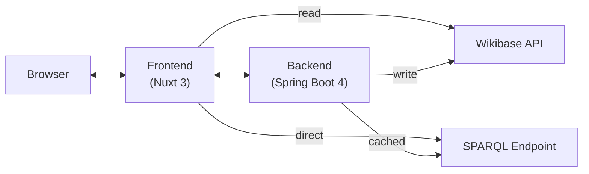
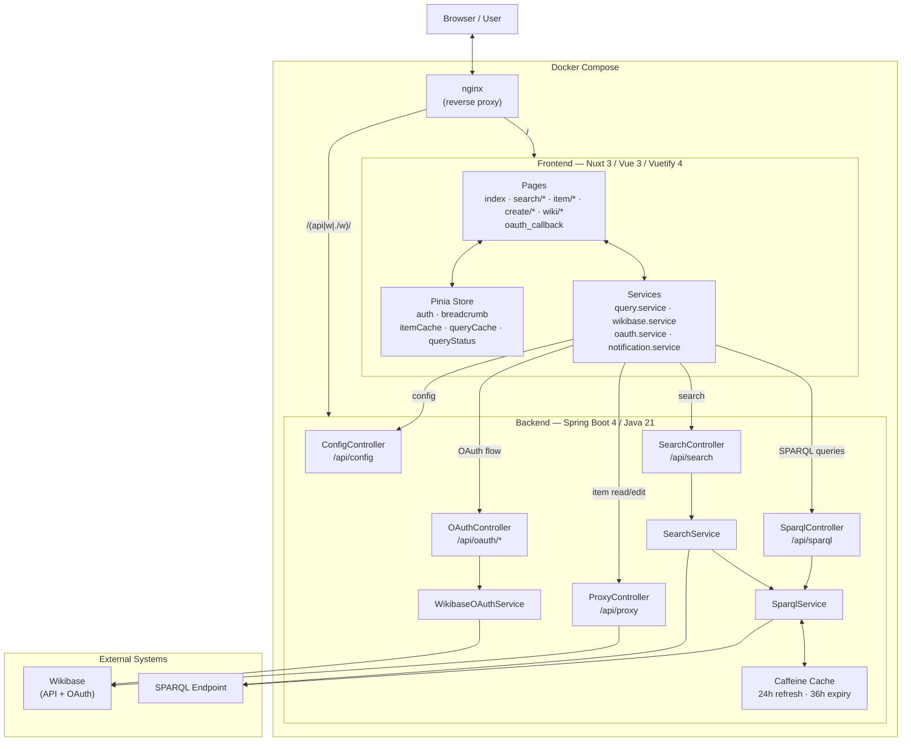
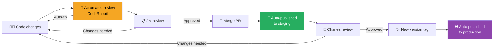

# PhiloBiblon UI - Technical Documentation

Welcome to the technical documentation for the PhiloBiblon UI project. This documentation is designed to help new developers understand the architecture, codebase structure, and key technical decisions.

## Project Overview

PhiloBiblon UI is a modern web application for querying and editing items in a Wikibase instance. It consists of two main modules:

- **Frontend**: A Nuxt 3 (Vue 3) single-page application with client-side rendering, using Vuetify 4 and Pinia
- **Backend**: A Spring Boot 4 middleware service handling OAuth authentication and API proxying

## Architecture Diagram

General overview:



All traffic from the browser passes through an **nginx reverse proxy** running inside Docker Compose. nginx routes requests matching `/(api|w|./w)/` to the backend, and everything else to the frontend (static SPA files). This means the browser always talks to a single origin, avoiding CORS issues. The `/w/` and `./w/` patterns cover Wikibase API and OAuth paths that the backend proxies.

**Item reads** (fetching Wikibase entities) go directly from the frontend to the Wikibase API — no backend involved. **Item writes** (edits) are proxied through the backend, which signs each request with OAuth 1.0a using a server-side consumer secret that is never exposed to the browser.

**SPARQL queries** use a two-level cache: the frontend holds an in-memory Pinia cache (2-min TTL, 100 entries) for repeated queries within the same browser session, and the backend holds a Caffeine cache (24h refresh, 36h expiry) shared across all users. Expensive search queries always go through the backend cache.

More detailed:



**Architecture Summary**:
- **nginx**: reverse proxy that routes `/(api|w|./w)/` to the backend and `/` to the frontend
- **Frontend (Nuxt 3)**: SPA served as static files; reads Wikibase directly, routes writes and SPARQL through the backend
- **Backend (Spring Boot 4)**: OAuth 1.0a proxy for writes, Caffeine-cached SPARQL endpoint, search API
- **Wikibase API**: item reads go directly from the frontend; writes are proxied through the backend with OAuth
- **SPARQL Endpoint**: queried via the backend (Caffeine cache, 24h refresh) for search and expensive queries; the frontend also maintains a short-lived in-memory cache (2 min)

## Documentation Structure

### Frontend Documentation
- [Setup Guide](frontend/setup.md) - Getting started with the frontend
- [Architecture](frontend/architecture.md) - Nuxt.js structure and configuration
- [State Management](frontend/state-management.md) - Vuex store modules
- [Services](frontend/services.md) - API and business logic services
- [Components](frontend/components.md) - Component architecture

### Backend Documentation
- [Setup Guide](backend/setup.md) - Getting started with the backend
- [Architecture](backend/architecture.md) - Spring Boot structure
- [Security & OAuth](backend/security.md) - Authentication and authorization
- [Caching](backend/caching.md) - SPARQL query caching

### Operations
- [CI/CD](cicd.md) - GitHub Actions workflows, GHCR image registry, and deploy secrets

## Quick Start

### Running with Docker
```bash
docker compose up --build -d
```

### Running Locally (Development)

**Frontend:**
```bash
cd frontend
yarn install
export API_BASE_URL=https://philobiblon.cog.berkeley.edu/ui-dev/
yarn dev
```

**Backend:**
```bash
cd backend
./mvnw spring-boot:run
```

## Key Technologies

### Frontend
- **Nuxt 3** - Vue.js framework (SSR disabled, SPA mode)
- **Vue 3** - Composition API
- **Vuetify 4** - Material Design component library
- **Pinia** - State management
- **wikibase-sdk** - Wikibase query utilities
- **wikibase-edit** - Wikibase editing library

### Backend
- **Spring Boot 4 / Java 21** - Java application framework
- **ScribeJava** - OAuth 1.0a library
- **Caffeine** - High-performance caching
- **Apache Jena** - SPARQL processing

## Development Workflow

> Branch naming and commit message conventions are documented in [CONTRIBUTING.md](../CONTRIBUTING.md).



1. **Code changes** — develop locally and open a Pull Request against `master`.
2. **Automated review** — CodeRabbit analyses the PR and may push auto-fixes directly to the branch.
3. **JM review** — Josep Maria reviews the PR; requests changes or approves.
4. **Merge PR** — merging to `master` triggers the staging CI/CD pipeline automatically.
5. **Staging** — the new build is deployed to the staging server within minutes.
6. **Charles review** — Charles tests the changes on staging; requests changes or approves.
7. **New version tag** — pushing a `v*` tag (e.g. `v1.2.3`) triggers the production pipeline.
8. **Production** — the tagged build is deployed to the production server automatically.

See [CI/CD](cicd.md) for details on the GitHub Actions workflows and deploy secrets.

## Getting Help

- Check the relevant documentation section for your area of work
- Review existing code for patterns and examples
- Ask questions in team channels
