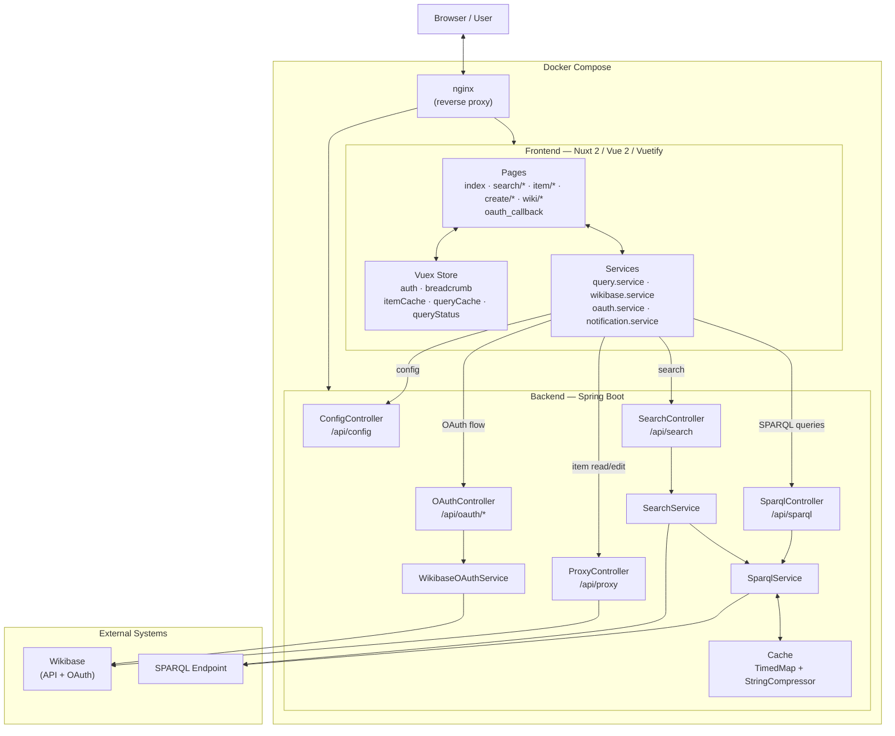

# PhiloBiblon UI - Technical Documentation

Welcome to the technical documentation for the PhiloBiblon UI project. This documentation is designed to help new developers understand the architecture, codebase structure, and key technical decisions.

## Project Overview

PhiloBiblon UI is a modern web application for querying and editing items in a Wikibase instance. It consists of two main modules:

- **Frontend**: A Nuxt.js (Vue 2) single-page application with client-side rendering
- **Backend**: A Spring Boot middleware service handling OAuth authentication and API proxying

## Architecture Diagram


> The source for this diagram is [`architecture.mmd`](architecture.mmd) (Mermaid format).



**Architecture Summary**:
- **nginx**: reverse proxy that routes `/` to the frontend and `/api/` to the backend
- **Frontend (Nuxt 2)**: SPA served as static files; reads Wikibase directly, routes writes and SPARQL through the backend
- **Backend (Spring Boot)**: OAuth 1.0a proxy for writes, cached SPARQL endpoint, search API
- **Wikibase API**: item reads go directly from the frontend; writes are proxied through the backend with OAuth
- **SPARQL Endpoint**: queried by both the frontend (via backend proxy, 10-min cache) and indirectly through the search service

## Documentation Structure

### Frontend Documentation
- [Setup Guide](frontend/setup.md) - Getting started with the frontend
- [Architecture](frontend/architecture.md) - Nuxt.js structure and configuration
- [State Management](frontend/state-management.md) - Vuex store modules
- [Services](frontend/services.md) - API and business logic services
- [Components](frontend/components.md) - Component architecture

### Backend Documentation
- [Setup Guide](backend/setup.md) - Getting started with the backend
- [Architecture](backend/architecture.md) - Spring Boot structure
- [Security & OAuth](backend/security.md) - Authentication and authorization
- [Caching](backend/caching.md) - SPARQL query caching

### Operations
- [CI/CD](cicd.md) - GitHub Actions workflows, GHCR image registry, and deploy secrets

## Quick Start

### Running with Docker
```bash
docker compose up --build -d
```

### Running Locally (Development)

**Frontend:**
```bash
cd frontend
yarn install
export API_BASE_URL=https://philobiblon.cog.berkeley.edu/ui-dev/
yarn dev
```

**Backend:**
```bash
cd backend
./mvnw spring-boot:run
```

## Key Technologies

### Frontend
- **Nuxt.js 2** - Vue.js framework with SSR/SPA capabilities
- **Vuetify** - Material Design component library
- **Vuex** - State management
- **wikibase-sdk** - Wikibase query utilities
- **wikibase-edit** - Wikibase editing library

### Backend
- **Spring Boot 3** - Java application framework
- **ScribeJava** - OAuth 1.0a library
- **Caffeine** - High-performance caching
- **Apache Jena** - SPARQL processing

## Development Workflow

1. **Make changes** in your local environment
2. **Test locally** using the development servers
3. **Create a Pull Request** with your changes
4. **Code review** by team members
5. **Merge** after approval

## Getting Help

- Check the relevant documentation section for your area of work
- Review existing code for patterns and examples
- Ask questions in team channels
