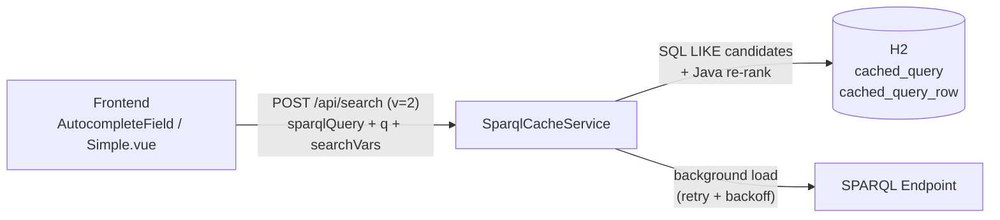

# SPARQL Caching

This document explains how the backend caches SPARQL query results.

## Why Cache SPARQL Queries?

SPARQL queries can be expensive:

- **Network latency**: Round-trip to SPARQL endpoint
- **Query execution time**: Complex queries take seconds (the global-search query loads the whole dataset)
- **Resource usage**: CPU and memory on SPARQL server

Caching provides:

- **Faster response times**: Instant results for cached queries
- **Reduced load**: Fewer requests to SPARQL endpoint
- **Better UX**: Snappier search interface

## Architecture

`POST /api/search` is served by a **DB-backed materialized cache** (`SparqlCacheServiceImpl`),
persisted in the embedded H2 database so it survives restarts and deploys.



### Data model

| Table | Purpose |
|---|---|
| `cached_query` | Registry of every query ever received: SHA-256 hash (PK, over `searchVars + "\n" + queryText`), the **full query text** (so the backend can re-execute it without any client), `search_vars`, current `generation` (0 = never loaded), `created_at` / `last_refreshed_at` / `last_accessed_at`, `last_error`, `label_hint`, `usage_since_refresh` / `usage_total` |
| `cached_query_row` | One row per query result: `label`, normalized `search_text` (composition of the query's `searchVars` values), full value map as JSON `payload`, `generation`. Indexed by `(query_hash, generation)` |

The cache key is the **exact query text** — the frontend and the seed tooling
(`scripts/seed-cache/`) share the same template code (`frontend/service/query.templates.js`)
so they generate byte-identical queries.

### Request flow (v=2 contract)

1. Hash the incoming `searchVars` + `sparqlQuery`.
2. Unknown query → validate it parses (400 otherwise), register it, schedule a
   **background load** (single-flight: concurrent misses share one execution) and answer
   immediately with `{"indexLoading": true, "results": []}`. The frontend shows a
   loading message and retries.
3. Known query → SQL `LIKE` per search word (AND-ed, so reordered multi-word terms
   match) over `search_text`, re-rank the candidates in Java
   (`SearchServiceImpl.rank`), rebuild `Option`s from the JSON payload.

The param-less legacy contract (bare array, blocks on a cold query) exists for
already-deployed SPAs and is scheduled for removal.

### Loading, refresh and eviction

- **Loads** execute with a forced HTTP/1.1 client, a 15-minute timeout and exponential
  backoff retries (`search.index.retry.*`). Results swap in under a new *generation*;
  on failure or an empty re-load the previous generation keeps serving. On success,
  `usage_since_refresh` resets to 0 (this cycle's demand has been satisfied); `usage_total`
  never resets.
- **Usage tracking**: every warm hit increments an in-memory per-query counter, persisted
  to `usage_since_refresh`/`usage_total` with the same throttling (at most once per hour)
  as `last_accessed_at`. All pending in-memory counts are flushed to the DB before the
  nightly refresh reads them, so a query touched only minutes ago is never mistaken for
  unused.
- **Nightly cron** (`search.index.refreshCron`, default 03:00): flushes pending usage,
  evicts queries not accessed for `search.cache.evictAfterDays` (default 30), then
  re-executes only the queries used at least once since their last refresh
  (`usage_since_refresh > 0`) — plus any query that has never completed a load, which
  always gets another attempt regardless of usage. Set
  `search.cache.refresh.requireUsage=false` to revert to refreshing every registered
  query every night.
- **Startup**: no full refresh (the H2 file persists); only orphan-row cleanup and
  resuming queries that never completed a load.

### Configuration

```properties
search.cache.evictAfterDays=30      # drop queries unused for N days
search.cache.candidateLimit=1000    # SQL LIKE candidate window before re-ranking
search.cache.maxResultLimit=300     # server-side cap for returned options
search.cache.loadConcurrency=2      # background loader threads
search.cache.syncTimeoutSeconds=60  # legacy contract: max blocking wait on a cold query
search.cache.refresh.requireUsage=true  # nightly cron only reloads queries used since their last refresh
search.index.refreshCron=0 0 3 * * *
search.index.retry.maxAttempts=5
search.index.retry.initialBackoffMs=10000
search.index.retry.backoffMultiplier=4
```

### Observability

`GET /api/search/cache/status` reports, per registered query: hint, snippet, generation,
row count, last refresh/access, last error, usage counters (since last refresh and
lifetime total) and whether a load is in flight, plus totals — including `dbFileSizeBytes`,
the actual size of the H2 MVStore file on disk (also logged at the end of every nightly
refresh). Every generation swap deletes a batch of rows and inserts a similarly-sized
new one; H2 doesn't rewrite deleted space in place, so this delete/insert churn is
reclaimed by MVStore's own background compaction (`AUTO_COMPACT_FILL_RATE`, 90% by
default) rather than anything this app triggers. `dbFileSizeBytes` is how to notice, over
time, whether that default compaction is keeping pace with the churn — not a signal that
triggers any automatic action.

### Seeding

See `scripts/seed-cache/README.md`: a Node generator emits every autocomplete/global
query the frontend can send (byte-identical), and a curl executor fires them and polls
until all indexes are materialized. Needed only for the initial seed of an environment
or after changing filter templates — periodic refresh is the backend's own cron.

## Frontend cache

Independent of the backend cache, `stores/queryCache.js` keeps a small in-memory cache
(2-minute TTL, 100 entries, keyed by query hash) for the direct-to-endpoint SPARQL
queries used by the result grids. It does not apply to `/api/search`.

## History

Until 2026 the backend had two mechanisms: an in-memory Caffeine `LoadingCache`
(blob per query, lost on restart, no retries) behind `/api/search` +
`/api/sparql/query`, and a separate DB-backed language index behind
`/api/search/quick`. They were unified into the model above; `/api/search/quick`
remains temporarily as an alias for cached SPAs.
