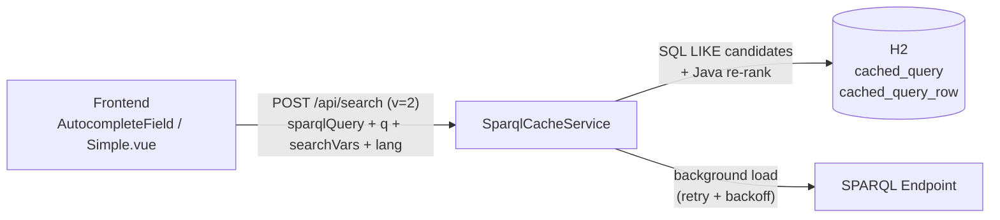

# SPARQL Caching

This document explains how the backend caches SPARQL query results.

## Why Cache SPARQL Queries?

SPARQL queries can be expensive:

- **Network latency**: Round-trip to SPARQL endpoint
- **Query execution time**: Complex queries take seconds (the global-search query loads the whole dataset)
- **Resource usage**: CPU and memory on SPARQL server

Caching provides:

- **Faster response times**: Instant results for cached queries
- **Reduced load**: Fewer requests to SPARQL endpoint
- **Better UX**: Snappier search interface

## Architecture

`POST /api/search` is served by a **DB-backed materialized cache** (`SparqlCacheServiceImpl`),
persisted in the embedded H2 database so it survives restarts and deploys.


```mermaid
flowchart LR
    FE["Frontend\nAutocompleteField / Simple.vue"] -->|"POST /api/search (v=2)\nsparqlQuery + q + searchVars + lang"| SVC["SparqlCacheService"]
    SVC -->|"SQL LIKE candidates\n+ Java re-rank"| DB[("H2\ncached_query\ncached_query_row")]
    SVC -->|"background load\n(retry + backoff)"| SE["SPARQL Endpoint"]
```

### Data model

| Table | Purpose |
|---|---|
| `cached_query` | Registry of every query ever received: SHA-256 hash (PK, over `searchVars + "\n" + queryText`), the **full query text** (so the backend can re-execute it without any client), `search_vars`, `lang_aware` (query projects `?lang`), `db_aware` (query projects `?db`), current `generation` (0 = never loaded), `created_at` / `last_refreshed_at` / `last_accessed_at`, `last_error`, `label_hint`, `usage_since_refresh` / `usage_total` |
| `cached_query_row` | One row per query result. Lang-aware queries fill one `label_xx` / `search_text_xx` column pair per UI language (en, ca, es, gl, pt); legacy per-language queries fill the single `label` / `search_text` pair. `search_text_xx` is the normalized composition of the query's `searchVars` values in that language; the full value map is stored as JSON `payload` (per-language values under `label_xx` / `aliases_xx` / `desc_xx` keys). Db-aware queries additionally fill `db_groups` — the row's database-group membership as space-delimited padded tokens (`" BETA BITECA "`). Indexed by `(query_hash, generation)` |

The cache key is the **exact query text** — the frontend and the seed tooling
(`scripts/seed-cache/`) share the same template code (`frontend/service/query.templates.js`)
so they generate byte-identical queries.

### One query for all languages

Frontend query templates are **language-free**: instead of one query per UI language
(5 cache entries per logical query), each query fetches labels/descriptions in all five
languages at once and projects a `?lang` var. At load time the backend pivots the
per-language solutions into **one row per item with per-language columns**, grouping by
the values of every projected var except `?lang` and the per-lang vars
(`label`/`aliases`/`desc`). Languages with no value are fallback-filled at
materialization time (en → first non-empty language → `pbid`), so an item labeled only
in English is still findable — and displayed — under any UI language.

The v=2 request carries an optional `lang` param (default `en`, 400 on unknown values):
it selects which `search_text_xx` column the SQL `LIKE` targets and which
label/desc/aliases are returned. Display resolution falls back per field
(requested lang → en → any). Legacy queries (no `?lang` projection) ignore the param.

### One query for all databases

The database group (BETA/BITECA/BITAGAP) is likewise no longer baked into the query
text. Templates match every group (`(.*)` in the pbid regex) and bind each source
record's pbid prefix as a reserved `?db` var, projected alongside the results. During
the pivot `?db` is excluded from the grouping key and its values are collected into
the row's `db_groups` membership — crucially, in most autocomplete queries the
database filter applies to a *related* source record (e.g. "authors of works in
BETA"), so one cached row can legitimately belong to several groups at once.

The v=2 request carries an optional `group` param (`BETA`/`BITECA`/`BITAGAP`; absent
or `ALL` means no filter; 400 on unknown values): it ANDs a membership `LIKE` over
`db_groups` into the candidate query. It is ignored for non-db-aware queries.

### One query for all BITAGAP subgroups

The BITAGAP thematic subgroups (ORIG/CARTAS, i.e. whether a related BITAGAP subject
label contains the `[Cartas de]` marker) follow the same membership model. Every
query computes each source record's membership in a self-contained OPTIONAL that
binds a reserved `?bg` var — per table, from the labels of the related BITAGAP subid
topics, of the subjects of related BITAGAP texids, or of the item's own labels (subid
and the subject autocompletes). An item reachable via both kinds of subjects belongs
to both; an item with no related BITAGAP subject belongs to neither and is excluded
whenever a subgroup filter is requested (matching the old constraining-join
semantics). Collected values land in the row's `bitagap_groups` column and the
optional `bitagapGroup` param (`ORIG`/`CARTAS`; absent or `ALL` → no filter; 400 on
unknown values; ignored for non-bg-aware queries) filters at search time. libid has
no subgroup semantics and its templates carry no `?bg`.

This membership OPTIONAL runs on every load and nightly refresh of every affected
query — the cost of serving subgroup selections instantly from the same single entry
per field. It also structurally fixed a long-standing bug: the old subject-autocomplete
subgroup filter referenced `?label` inside a subquery where it is never bound, so any
ORIG/CARTAS selection returned zero subject options.

### Request flow (v=2 contract)

1. Hash the incoming `searchVars` + `sparqlQuery`.
2. Unknown query → validate it parses (400 otherwise), register it (detecting
   `lang_aware` from the projection), schedule a **background load** (single-flight:
   concurrent misses share one execution) and answer immediately with
   `{"indexLoading": true, "results": []}`. The frontend shows a loading message and
   retries.
3. Known query → SQL `LIKE` per search word (AND-ed, so reordered multi-word terms
   match) over the requested language's `search_text_xx` column (or legacy
   `search_text`), plus a `db_groups` membership filter when a `group` was requested
   on a db-aware query; re-rank the candidates in Java (`SearchServiceImpl.rank`),
   rebuild `Option`s from the JSON payload with the per-language keys resolved for
   the requested language.

### Loading, refresh and eviction

- **Loads** execute with a forced HTTP/1.1 client, a 15-minute timeout and exponential
  backoff retries (`search.index.retry.*`). Results swap in under a new *generation*;
  on failure or an empty re-load the previous generation keeps serving. On success,
  `usage_since_refresh` resets to 0 (this cycle's demand has been satisfied); `usage_total`
  never resets.
- **Usage tracking**: every warm hit increments an in-memory per-query counter, persisted
  to `usage_since_refresh`/`usage_total` with the same throttling (at most once per hour)
  as `last_accessed_at`. All pending in-memory counts are flushed to the DB before the
  nightly refresh reads them, so a query touched only minutes ago is never mistaken for
  unused.
- **Nightly cron** (`search.index.refreshCron`, default 03:00): flushes pending usage,
  evicts queries not accessed for `search.cache.evictAfterDays` (default 30), then
  re-executes only the queries used at least once since their last refresh
  (`usage_since_refresh > 0`) — plus any query that has never completed a load, which
  always gets another attempt regardless of usage. Set
  `search.cache.refresh.requireUsage=false` to revert to refreshing every registered
  query every night.
- **Startup**: no full refresh (the H2 file persists); only orphan-row cleanup and
  resuming queries that never completed a load.

### Configuration

```properties
search.cache.evictAfterDays=30      # drop queries unused for N days
search.cache.candidateLimit=1000    # SQL LIKE candidate window before re-ranking
search.cache.maxResultLimit=300     # server-side cap for returned options
search.cache.loadConcurrency=2      # background loader threads
search.cache.refresh.requireUsage=true  # nightly cron only reloads queries used since their last refresh
search.index.refreshCron=0 0 3 * * *
search.index.retry.maxAttempts=5
search.index.retry.initialBackoffMs=10000
search.index.retry.backoffMultiplier=4
```

### Observability

`GET /api/search/cache/status` reports, per registered query: hint, snippet, generation,
row count, last refresh/access, last error, usage counters (since last refresh and
lifetime total) and whether a load is in flight, plus totals — including `dbFileSizeBytes`,
the actual size of the H2 MVStore file on disk (also logged at the end of every nightly
refresh). Every generation swap deletes a batch of rows and inserts a similarly-sized
new one; H2 doesn't rewrite deleted space in place, so this delete/insert churn is
reclaimed by MVStore's own background compaction (`AUTO_COMPACT_FILL_RATE`, 90% by
default) rather than anything this app triggers. `dbFileSizeBytes` is how to notice, over
time, whether that default compaction is keeping pace with the churn — not a signal that
triggers any automatic action.

### Seeding

See `scripts/seed-cache/README.md`: a Node generator emits every autocomplete/global
query the frontend can send (byte-identical), and a curl executor fires them and polls
until all indexes are materialized. Needed only for the initial seed of an environment
or after changing filter templates — periodic refresh is the backend's own cron.

## Frontend cache

Independent of the backend cache, `stores/queryCache.js` keeps a small in-memory cache
(2-minute TTL, 100 entries, keyed by query hash) for the direct-to-endpoint SPARQL
queries used by the result grids. It does not apply to `/api/search`.

## History

Until 2026 the backend had two mechanisms: an in-memory Caffeine `LoadingCache`
(blob per query, lost on restart, no retries) behind `/api/search` +
`/api/sparql/query`, and a separate DB-backed language index behind
`/api/search/quick`. They were unified into the model above; the `/api/search/quick`
alias and the param-less legacy `/api/search` contract were later removed, leaving
`v=2` as the only contract. The orphaned `SEARCH_ITEM` table from the old language
index is not dropped by `ddl-auto=update`; it is harmless to leave, or can be removed
manually (`DROP TABLE SEARCH_ITEM` via the dev H2 console).

Originally each UI language and each database group produced its own query text and
therefore its own cache entry (×5 languages, ×4 groups per field). Queries were later
made language- and database-free (see the sections above). All of these iterations
happened on one branch before any deployment, so no intermediate contract or query
shape ever shipped: the transition visible in production is a single jump from the
pre-unification SPA (which calls the removed `/quick` and param-less endpoints, and
breaks until the browser reloads it) to the final model. Queries that don't project
the reserved `?lang`/`?db` vars still work through the plain single-column path —
that is the v=2 base case for arbitrary SPARQL, not a compatibility shim.
