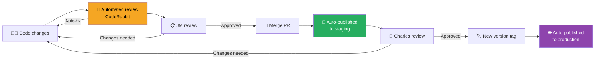

# Development workflow

```mermaid
flowchart LR
    A[🧑‍💻 Code changes] --> B[🤖 Automated review\nCodeRabbit]
    B -->|Auto-fix| A
    B --> C[📋 JM review]
    C -->|Changes needed| A
    C -->|Approved| D[🔀 Merge PR]
    D --> E[🚀 Auto-published\nto staging]
    E --> F[👤 Charles review]
    F -->|Changes needed| A
    F -->|Approved| G[🏷️ New version tag]
    G --> H[🌐 Auto-published\nto production]

    style B fill:#f5a623,color:#000
    style E fill:#27ae60,color:#fff
    style H fill:#8e44ad,color:#fff
```
